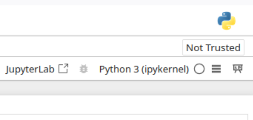
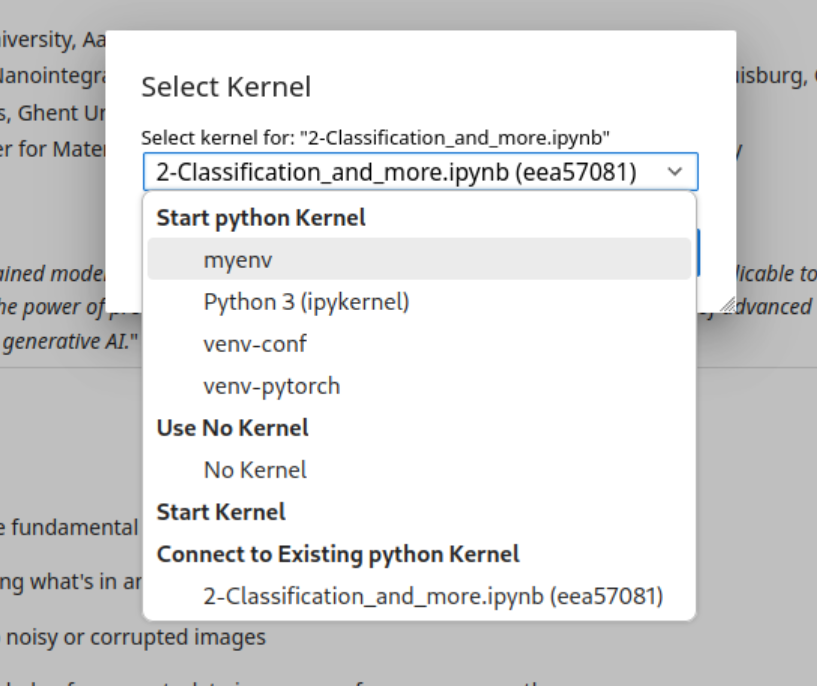

# Create and Activate a Python Virtual Environment

Follow these steps to set up the Python environment and install dependencies.

---

## Prerequisites
- **Python 3.6+**: Ensure Python is installed. Verify with:  
  ```bash
  python --version
  ```
- **pip**: Package installer for Python. Usually included with modern Python installations.

---
## Creating and Starting the Environment

### macOS / Linux
1. Open **Terminal**.
2. Navigate to your project directory:
   ```bash
   cd path/to/your/project
   ```
3. Create a virtual environment:
   ```bash
   python3 -m venv myenv
   ```
4. Activate the environment:
   ```bash
   source myenv/bin/activate
   ```

### Windows (Command Prompt/PowerShell)
1. Open **Command Prompt** or **PowerShell**.
2. Navigate to your project directory:
   ```cmd
   cd path\to\your\project
   ```
3. Create a virtual environment:
   ```cmd
   python -m venv myenv
   ```
4. Activate the environment:
   - **Command Prompt**:
     ```cmd
     myenv\Scripts\activate.bat
     ```
   - **PowerShell**:
     ```powershell
     .\myenv\Scripts\Activate.ps1
     ```
     or alternatively, if the above gives an error (may require admin permissions)
     ```powershell
     Set-ExecutionPolicy Unrestricted -Scope Process -Force
     .\myenv\Scripts\Activate.ps1
     ```

---

## Install Dependencies
Run this command after activating the virtual environment:
```bash
pip install -r requirements.txt
```

---

## Installing and Running the IPython venv Kernel
The Jupyter Notebook and other frontends automatically ensure that the IPython kernel is available. However, if you want to use your newly created virtual environment as a then you need to enable it manually. 

To do so make sure the environment is activated, `myenv` in the example below, and then run the command
```bash
python -m ipykernel install --user --name myenv --display-name "Python (myenv)"
```
Now start Jupyter
```bash
jupyter notebook
```

Select the notebook you want to work in and then check the top right hand side corner to see which kernel is running your notebooks, as shown in the the screenshot below


Click on the running kernel, in the screenshot above the default `Python 3 (ipykernel)` is being used. If you want to cahange this to your created virtual environment then click on the current kernel, `Python 3 (ipykernel)` in this case, and a list of kernel should appear as show in the screenshot below. From here you can select your virtual environment to be your kernel.


---

## Deactivate the Environment
When done, exit the virtual environment:
```bash
deactivate
```
Use the jupyter kernelspec command to remove the kernel specification for Jupyter
```bash
jupyter kernelspec uninstall myenv
```
---

## Troubleshooting
- **"python3: command not found" (macOS/Linux)**:  
  Install Python from [python.org](https://www.python.org/downloads/).
- **ModuleNotFoundError: No module named 'venv' (Linux)**:  
  Install the `python3-venv` package:
  ```bash
  sudo apt-get install python3-venv
  ```
- **Permission Issues (Windows)**:  
  Run PowerShell/CMD as **Administrator**.
- **Outdated pip**: Upgrade pip before installing requirements:
  ```bash
  pip install --upgrade pip
  ```

---

**Note**: Replace `path/to/your/project` with your actual project directory path.  
For issues not listed here, consult the [Python venv documentation](https://docs.python.org/3/library/venv.html).